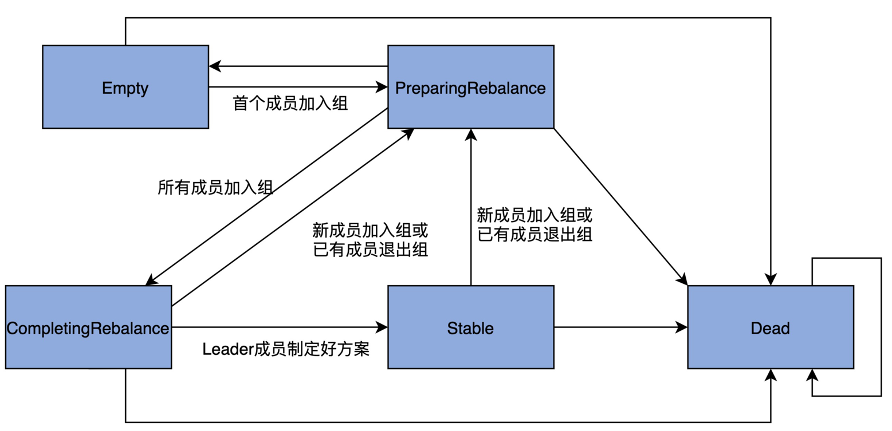

### MemberSummary 消费者组成员概要数据
```scala
case class MemberSummary(memberId: String,                // 成员ID，consumer-group ID-< 序号 >-
                         groupInstanceId: Option[String], // 消费者组静态成员的 ID
                         clientId: String,                // 消费者组成员配置的 client.id 参数
                         clientHost: String,              // 运行消费者程序的主机名
                         metadata: Array[Byte],           // 消费者组成员分区分配策略的字节数组，默认是RangeAssignor
                         assignment: Array[Byte])         // 分配给该成员的订阅分区
```

### MemberMetadata 消费者组成员的元数据
- Heartbeat metadata
    - 心跳会话超时时间
    - 最后一次心跳的时间戳
- Protocol metadata
    - 支持的protocols列表
    - 每个protocol的元数据
- Awaiting rebalance callback：when the group is in the prepare-rebalance state,its rebalance callback will be kept in the metadata if the member has sent the join group request
- Awaiting sync callback：when the group is in the  state, its sync callback is kept in metadata until the leader provides the group assignment and the group transitions to stable
```scala
private object MemberMetadata {
  // 提取出分区分配策略的名称
  def plainProtocolSet(supportedProtocols: List[(String, Array[Byte])]) = supportedProtocols.map(_._1).toSet
}

@nonthreadsafe
private[group] class MemberMetadata(var memberId: String,
                                    val groupId: String,
                                    val groupInstanceId: Option[String],
                                    val clientId: String,
                                    val clientHost: String,
                                    val rebalanceTimeoutMs: Int,  // Rebalance 操作的超时时间，配置项max.poll.interval.ms
                                    val sessionTimeoutMs: Int,    // 会话超时时间，配置项session.timeout.ms
                                    val protocolType: String,     // 协议类型，可以为consumer或者connect
                                    var supportedProtocols: List[(String, Array[Byte])]) { // 配置的多组分区分配策略，配置项partition.assignment.strategy

  var assignment: Array[Byte] = Array.empty[Byte] // 保存分配给该成员的分区分配方案
  var awaitingJoinCallback: JoinGroupResult => Unit = null // 表示组成员是否正在等待加入组
  var awaitingSyncCallback: SyncGroupResult => Unit = null // 表示组成员是否正在等待 GroupCoordinator 发送分配方案
  var isLeaving: Boolean = false // 表示组成员是否发起“退出组”的操作
  var isNew: Boolean = false // 表示是否是消费者组下的新成员

  /**
   * Get metadata corresponding to the provided protocol.
   */
  def metadata(protocol: String): Array[Byte] = {
    supportedProtocols.find(_._1 == protocol) match {
      case Some((_, metadata)) => metadata
      case None =>
        throw new IllegalArgumentException("Member does not support protocol")
    }
  }
}
```

### GroupState 消费者组状态
一个消费者组从创建到正常工作，它的状态流转路径是 Empty -> PreparingRebalance -> CompletingRebalance -> Stable

```scala
private[group] sealed trait GroupState {
  val validPreviousStates: Set[GroupState]
}

private[group] case object Empty extends GroupState {
  val validPreviousStates: Set[GroupState] = Set(PreparingRebalance)
}

private[group] case object PreparingRebalance extends GroupState {
  val validPreviousStates: Set[GroupState] = Set(Stable, CompletingRebalance, Empty)
}

private[group] case object CompletingRebalance extends GroupState {
  val validPreviousStates: Set[GroupState] = Set(PreparingRebalance)
}

private[group] case object Stable extends GroupState {
  val validPreviousStates: Set[GroupState] = Set(CompletingRebalance)
}

private[group] case object Dead extends GroupState {
  val validPreviousStates: Set[GroupState] = Set(Stable, PreparingRebalance, CompletingRebalance, Empty, Dead)
}
```

### GroupOverview & GroupSummary 消费者组概要数据
```scala
/**
 * Case class used to represent group metadata for the ListGroups API
 */
case class GroupOverview(groupId: String,      // 组ID信息，即group.id参数值
                         protocolType: String) // 消费者组的协议类型

/**
 * Case class used to represent group metadata for the DescribeGroup API
 */
case class GroupSummary(state: String,
                        protocolType: String,
                        protocol: String,             // 消费者组选定的分区分配策略
                        members: List[MemberSummary]) // 成员元数据
```

### GroupMetadata 消费者组的元数据
- Membership metadata
    - Members registered in this group：在消费者中注册的成员
    - Current protocol assigned to the group：当前分配给该组的协议
    - Protocol metadata associated with group members：与组成员关联的协议元数据
- State metadata
    - group state：消费者组状态
    - generation id：消费者组的Generation号，每次执行 Rebalance 时，Generation 数都要加 1
    - leader id：消费者组中Leader 成员的ID，当消费者组执行 Rebalance 时，需要选举一个成员作为 Leader，负责为所有成员制定分区分配方案。
```scala
@nonthreadsafe
private[group] class GroupMetadata(val groupId: String, initialState: GroupState, time: Time) extends Logging {
  type JoinCallback = JoinGroupResult => Unit

  private[group] val lock = new ReentrantLock

  private var state: GroupState = initialState  // 组状态
  var currentStateTimestamp: Option[Long] = Some(time.milliseconds()) // 最近一次变更的时间戳，用于确定位移主题中的过期消息
  var protocolType: Option[String] = None       // 协议类型
  var protocolName: Option[String] = None       // 协议名称
  var generationId = 0                          // 消费组 Generation 号，标记Rebalance 操作的次数
  private var leaderId: Option[String] = None   // 消费者组中 Leader 成员的 ID 信息

  private val members = new mutable.HashMap[String, MemberMetadata] // 消费者组下所有成员的元数据信息
  // Static membership mapping [key: group.instance.id, value: member.id]
  private val staticMembers = new mutable.HashMap[String, String]
  private val pendingMembers = new mutable.HashSet[String]
  private var numMembersAwaitingJoin = 0
  private val supportedProtocols = new mutable.HashMap[String, Integer]().withDefaultValue(0) // 分区分配策略的支持票数
  private val offsets = new mutable.HashMap[TopicPartition, CommitRecordMetadataAndOffset]    // 按照主题分区分组的位移主题消息位移值的HashMap
  private val pendingOffsetCommits = new mutable.HashMap[TopicPartition, OffsetAndMetadata]
  private val pendingTransactionalOffsetCommits = new mutable.HashMap[Long, mutable.Map[TopicPartition, CommitRecordMetadataAndOffset]]()
  private var receivedTransactionalOffsetCommits = false
  private var receivedConsumerOffsetCommits = false

  // When protocolType == `consumer`, a set of subscribed topics is maintained. 
  private var subscribedTopics: Option[Set[String]] = None  // 消费者组订阅的主题列表

  def is(groupState: GroupState) = state == groupState
  def not(groupState: GroupState) = state != groupState
  def has(memberId: String) = members.contains(memberId)
  def get(memberId: String) = members(memberId)
  def size = members.size

}
```
#### 管理消费者组状态
```scala
  // 更新状态
  def transitionTo(groupState: GroupState): Unit = {
    // 校验合法前置状态
    assertValidTransition(groupState)
    state = groupState
    currentStateTimestamp = Some(time.milliseconds())
  }

  // 是否能够开启 Rebalance 操作
  // 当前状态是否是 PreparingRebalance 状态的合法前置状态
  // 只有 Stable、CompletingRebalance 和 Empty 状态的消费者组，才有资格开启 Rebalance。
  def canRebalance = PreparingRebalance.validPreviousStates.contains(state)
```
#### 管理成员
```scala
  // 添加成员
  def add(member: MemberMetadata, callback: JoinCallback = null): Unit = {
    // 如果消费者组为空
    if (members.isEmpty)
      // 把添加的第一个消费者组成员的procotolType设置为消费者组的protocolType
      this.protocolType = Some(member.protocolType)

    // 校验成员元数据中的groupId和组Id是否相同
    assert(groupId == member.groupId)
    // 校验成员元数据中的protoclType和组protocolType是否相同
    assert(this.protocolType.orNull == member.protocolType)
    // 校验该成员选定的分区分配策略与组选定的分区分配策略是否匹配
    assert(supportsProtocols(member.protocolType, MemberMetadata.plainProtocolSet(member.supportedProtocols)))

    // 如果尚未选出Leader成员
    if (leaderId.isEmpty)
      leaderId = Some(member.memberId)
    // 将该成员添加进members
    members.put(member.memberId, member)
    // 更新分区分配策略支持票数(票数+1)
    member.supportedProtocols.foreach{ case (protocol, _) => supportedProtocols(protocol) += 1 }
    // 设置成员加入组后的回调逻辑
    member.awaitingJoinCallback = callback
    // 更新已加入组的成员数
    if (member.isAwaitingJoin)
      numMembersAwaitingJoin += 1
  }

  // 移除成员
  def remove(memberId: String): Unit = {
    members.remove(memberId).foreach { member =>
      // 更新分区分配策略支持票数(票数-1)
      member.supportedProtocols.foreach{ case (protocol, _) => supportedProtocols(protocol) -= 1 }
      // 更新已加入组的成员数
      if (member.isAwaitingJoin)
        numMembersAwaitingJoin -= 1
    }

    // 如果该成员是Leader，选择剩下成员列表中的第一个作为新的Leader成员
    if (isLeader(memberId))
      leaderId = members.keys.headOption
  }
```
#### 管理位移
- 消费者组需要向 Coordinator 提交已消费消息的进度，在 Kafka 中，这个进度有个专门的术语，叫作**提交位移**。Kafka 使用它来定位消费者组要消费的下一条消息。
- 那么，提交位移在 Coordinator 端是如何保存的呢？它实际上是保存在内部位移主题中。提交的方式是，消费者组成员向内部主题写入符合特定格式的事件消息，这类消息就是所谓的**位移提交消息**（Commit Record）。
```scala
/**
  * We cache offset commits along with their commit record offset.
  */
case class CommitRecordMetadataAndOffset(appendedBatchOffset: Option[Long], offsetAndMetadata: OffsetAndMetadata) {
  def olderThan(that: CommitRecordMetadataAndOffset): Boolean = appendedBatchOffset.get < that.appendedBatchOffset.get
}

  // 初始化位移值
  def initializeOffsets(offsets: collection.Map[TopicPartition, CommitRecordMetadataAndOffset],
                        pendingTxnOffsets: Map[Long, mutable.Map[TopicPartition, CommitRecordMetadataAndOffset]]): Unit = {
    this.offsets ++= offsets
    this.pendingTransactionalOffsetCommits ++= pendingTxnOffsets
  }

  // 在提交位移消息被成功写入后调用
  def onOffsetCommitAppend(topicPartition: TopicPartition, offsetWithCommitRecordMetadata: CommitRecordMetadataAndOffset): Unit = {
    if (pendingOffsetCommits.contains(topicPartition)) {
      if (offsetWithCommitRecordMetadata.appendedBatchOffset.isEmpty)
        throw new IllegalStateException("Cannot complete offset commit write without providing the metadata of the record " +
          "in the log.")
      // offsets字段中没有该分区位移提交消息 或 offsets字段中该分区的位移提交消息在位移主题中的位移值小于待写入的位移值
      if (!offsets.contains(topicPartition) || offsets(topicPartition).olderThan(offsetWithCommitRecordMetadata))
        offsets.put(topicPartition, offsetWithCommitRecordMetadata)
    }

    pendingOffsetCommits.get(topicPartition) match {
      case Some(stagedOffset) if offsetWithCommitRecordMetadata.offsetAndMetadata == stagedOffset =>
        pendingOffsetCommits.remove(topicPartition)
      case _ =>
        // The pendingOffsetCommits for this partition could be empty if the topic was deleted, in which case
        // its entries would be removed from the cache by the `removeOffsets` method.
    }
  }

  // 移除位移，如果当前时间与已提交位移消息时间戳的差值，超过了配置项offsets.retention.minutes值，Kafka就会将这条记录从 offsets 字段中移除
  def removeExpiredOffsets(currentTimestamp: Long, offsetRetentionMs: Long): Map[TopicPartition, OffsetAndMetadata] = {

    // 获取订阅分区过期的位移值
    def getExpiredOffsets(baseTimestamp: CommitRecordMetadataAndOffset => Long,
                          subscribedTopics: Set[String] = Set.empty): Map[TopicPartition, OffsetAndMetadata] = {
      offsets.filter {
        case (topicPartition, commitRecordMetadataAndOffset) =>
          // 分区所属主题不在订阅主题列表之内
          !subscribedTopics.contains(topicPartition.topic()) &&
          // 该主题分区已经完成位移提交
          !pendingOffsetCommits.contains(topicPartition) && {
            // 该主题分区在位移主题中对应消息的存在时间超过了阈值
            commitRecordMetadataAndOffset.offsetAndMetadata.expireTimestamp match {
              case None =>
                // current version with no per partition retention
                // 如果消费者组状态是 Empty 状态，判断依据是当前时间与消费者组变为 Empty 状态时间的差值是否超过offsets.retention.minutes 值
                // 如果消费者组状态不是 Empty 状态，判断依据是当前时间与提交位移消息中的时间戳差值是否超过offsets.retention.minutes 值
                currentTimestamp - baseTimestamp(commitRecordMetadataAndOffset) >= offsetRetentionMs
              case Some(expireTimestamp) =>
                // older versions with explicit expire_timestamp field => old expiration semantics is used
                currentTimestamp >= expireTimestamp
            }
          }
      }.map {
        case (topicPartition, commitRecordOffsetAndMetadata) =>
          (topicPartition, commitRecordOffsetAndMetadata.offsetAndMetadata)
      }.toMap
    }

    val expiredOffsets: Map[TopicPartition, OffsetAndMetadata] = protocolType match {
      case Some(_) if is(Empty) =>
        // no consumer exists in the group =>
        // - if current state timestamp exists and retention period has passed since group became Empty,
        //   expire all offsets with no pending offset commit;
        // - if there is no current state timestamp (old group metadata schema) and retention period has passed
        //   since the last commit timestamp, expire the offset
        // 如果消费者组状态是 Empty，传入消费者组变更为 Empty 状态的时间；若该时间没有被记录，则使用提交位移消息本身的写入时间戳
        getExpiredOffsets(
          commitRecordMetadataAndOffset => currentStateTimestamp
            .getOrElse(commitRecordMetadataAndOffset.offsetAndMetadata.commitTimestamp)
        )

      case Some(ConsumerProtocol.PROTOCOL_TYPE) if subscribedTopics.isDefined =>
        // consumers exist in the group =>
        // - if the group is aware of the subscribed topics and retention period had passed since the
        //   the last commit timestamp, expire the offset. offset with pending offset commit are not
        //   expired
        // 如果是普通的消费者组类型 && 订阅主题信息已知，传入提交位移消息本身的写入时间戳和订阅主题集合
        getExpiredOffsets(
          _.offsetAndMetadata.commitTimestamp,
          subscribedTopics.get
        )

      case None =>
        // protocolType is None => standalone (simple) consumer, that uses Kafka for offset storage only
        // expire offsets with no pending offset commit that retention period has passed since their last commit
        // 如果 protocolType 为 None，就表示这个消费者组是一个 Standalone 消费者，传入提交位移消息本身的写入时间戳
        getExpiredOffsets(_.offsetAndMetadata.commitTimestamp)

      case _ =>
        Map()
    }

    if (expiredOffsets.nonEmpty)
      debug(s"Expired offsets from group '$groupId': ${expiredOffsets.keySet}")
    // 将过期位移对应的主题分区从offsets中移除
    offsets --= expiredOffsets.keySet
    expiredOffsets
  }
```
#### 管理分区分配策略
```scala
  // 选出消费者组的分区消费分配策略
  def selectProtocol: String = {
    if (members.isEmpty)
      throw new IllegalStateException("Cannot select protocol for empty group")

    // select the protocol for this group which is supported by all members
    val candidates = candidateProtocols

    // vote方法将candidates与每个成员的支持列表进行比对，找出成员支持列表中第一个包含在 candidates 中的策略进行投票，票数最多的那个策略当选
    val votes: List[(String, Int)] = allMemberMetadata
      .map(_.vote(candidates))
      .groupBy(identity)
      .mapValues(_.size)
      .toList

    votes.maxBy(_._2)._1
  }

  // 找出组内所有成员都支持的分区分配策略集
  private def candidateProtocols = {
    // get the set of protocols that are commonly supported by all members
    val numMembers = members.size
    supportedProtocols.filter(_._2 == numMembers).map(_._1).toSet
  }
```


