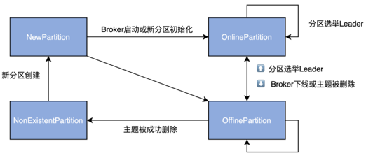

### PartitionStateMachine 分区状态机

#### PartitionState
1. NonExistentPartition: 未创建或已删除的分区
    - 前置状态为 OfflinePartition
2. NewPartition: 已创建的分区，但未有leader和ISR
    - 前置状态为 NonExistentPartition
3. OnlinePartition: 已选举出分区leader
    - 前置状态为 NewPartition, OnlinePartition, OfflinePartition
4. OfflinePartition: 分区leader挂掉
    - 前置状态为 NewPartition, OnlinePartition, OfflinePartition
```scala
sealed trait PartitionState {
  def state: Byte
  def validPreviousStates: Set[PartitionState]
}

case object NewPartition extends PartitionState {
  val state: Byte = 0
  val validPreviousStates: Set[PartitionState] = Set(NonExistentPartition)
}

case object OnlinePartition extends PartitionState {
  val state: Byte = 1
  val validPreviousStates: Set[PartitionState] = Set(NewPartition, OnlinePartition, OfflinePartition)
}

case object OfflinePartition extends PartitionState {
  val state: Byte = 2
  val validPreviousStates: Set[PartitionState] = Set(NewPartition, OnlinePartition, OfflinePartition)
}

case object NonExistentPartition extends PartitionState {
  val state: Byte = 3
  val validPreviousStates: Set[PartitionState] = Set(OfflinePartition)
}
```
#### 抽象类 PartitionStateMachine 
```scala

abstract class PartitionStateMachine(controllerContext: ControllerContext) extends Logging {

  // 在NewPartition or OfflinePartition转换为OnlinePartition时触发，成功选举controller和更新broker
  def triggerOnlinePartitionStateChange(): Unit = {
    val partitions = controllerContext.partitionsInStates(Set(OfflinePartition, NewPartition))
    triggerOnlineStateChangeForPartitions(partitions)
  }

  def triggerOnlinePartitionStateChange(topic: String): Unit = {
    val partitions = controllerContext.partitionsInStates(topic, Set(OfflinePartition, NewPartition))
    triggerOnlineStateChangeForPartitions(partitions)
  }

  private def triggerOnlineStateChangeForPartitions(partitions: collection.Set[TopicPartition]): Unit = {
    // 过滤待删除的主题分区
    val partitionsToTrigger = partitions.filter { partition =>
      !controllerContext.isTopicQueuedUpForDeletion(partition.topic)
    }.toSeq
    // 处理分区状态转换
    handleStateChanges(partitionsToTrigger, OnlinePartition, Some(OfflinePartitionLeaderElectionStrategy(false)))
  }

  // 
  private def initializePartitionState(): Unit = {
    for (topicPartition <- controllerContext.allPartitions) {
      // check if leader and isr path exists for partition. 
      controllerContext.partitionLeadershipInfo.get(topicPartition) match {
        case Some(currentLeaderIsrAndEpoch) =>
          // check if the leader for partition is alive. If yes, it is in Online state, else it is in Offline state
          if (controllerContext.isReplicaOnline(currentLeaderIsrAndEpoch.leaderAndIsr.leader, topicPartition))
            // leader is alive
            controllerContext.putPartitionState(topicPartition, OnlinePartition)
          else
            controllerContext.putPartitionState(topicPartition, OfflinePartition)
        case None => 
          controllerContext.putPartitionState(topicPartition, NewPartition)
      }
    }
  }

  def handleStateChanges(
    partitions: Seq[TopicPartition],
    targetState: PartitionState
  ): Map[TopicPartition, Either[Throwable, LeaderAndIsr]] = {
    handleStateChanges(partitions, targetState, None)
  }

  def handleStateChanges(
    partitions: Seq[TopicPartition],
    targetState: PartitionState,
    leaderElectionStrategy: Option[PartitionLeaderElectionStrategy]
  ): Map[TopicPartition, Either[Throwable, LeaderAndIsr]]

}
```
#### 实现类 ZkPartitionStateMachine
```scala
  override def handleStateChanges(
    partitions: Seq[TopicPartition],
    targetState: PartitionState,
    partitionLeaderElectionStrategyOpt: Option[PartitionLeaderElectionStrategy]
  ): Map[TopicPartition, Either[Throwable, LeaderAndIsr]] = {
    if (partitions.nonEmpty) {
      try {
        // 新建batch请求
        controllerBrokerRequestBatch.newBatch()
        // targetState不同会有不同的处理逻辑
        val result = doHandleStateChanges(
          partitions,
          targetState,
          partitionLeaderElectionStrategyOpt
        )
        // 给broker发送更新请求
        controllerBrokerRequestBatch.sendRequestsToBrokers(controllerContext.epoch)
        result
      } catch {
        case e: ControllerMovedException =>
          error(s"Controller moved to another broker when moving some partitions to $targetState state", e)
          throw e
        case e: Throwable =>
          error(s"Error while moving some partitions to $targetState state", e)
          partitions.iterator.map(_ -> Left(e)).toMap
      }
    } else {
      Map.empty
    }
  }

  private def doHandleStateChanges(
    partitions: Seq[TopicPartition],
    targetState: PartitionState,
    partitionLeaderElectionStrategyOpt: Option[PartitionLeaderElectionStrategy]
  ): Map[TopicPartition, Either[Throwable, LeaderAndIsr]] = {
    val stateChangeLog = stateChangeLogger.withControllerEpoch(controllerContext.epoch)
    partitions.foreach(partition => controllerContext.putPartitionStateIfNotExists(partition, NonExistentPartition))
    val (validPartitions, invalidPartitions) = controllerContext.checkValidPartitionStateChange(partitions, targetState)
    invalidPartitions.foreach(partition => logInvalidTransition(partition, targetState))

    targetState match {
      case NewPartition =>
        validPartitions.foreach { partition =>
          stateChangeLog.trace(s"Changed partition $partition state from ${partitionState(partition)} to $targetState with " +
            s"assigned replicas ${controllerContext.partitionReplicaAssignment(partition).mkString(",")}")
          // 更新controllerContext的分区状态
          controllerContext.putPartitionState(partition, NewPartition)
        }
        Map.empty
      case OnlinePartition =>
        // 状态为NewPartition的分区
        val uninitializedPartitions = validPartitions.filter(partition => partitionState(partition) == NewPartition)
        // 状态为OfflinePartition/OnlinePartition的分区
        val partitionsToElectLeader = validPartitions.filter(partition => partitionState(partition) == OfflinePartition || partitionState(partition) == OnlinePartition)
        if (uninitializedPartitions.nonEmpty) {
          val successfulInitializations = initializeLeaderAndIsrForPartitions(uninitializedPartitions)
          successfulInitializations.foreach { partition =>
            stateChangeLog.trace(s"Changed partition $partition from ${partitionState(partition)} to $targetState with state " +
              s"${controllerContext.partitionLeadershipInfo(partition).leaderAndIsr}")
            // 更新controllerContext的分区状态
            controllerContext.putPartitionState(partition, OnlinePartition)
          }
        }
        if (partitionsToElectLeader.nonEmpty) {
          val electionResults = electLeaderForPartitions(
            partitionsToElectLeader,
            partitionLeaderElectionStrategyOpt.getOrElse(
              throw new IllegalArgumentException("Election strategy is a required field when the target state is OnlinePartition")
            )
          )

          electionResults.foreach {
            case (partition, Right(leaderAndIsr)) =>
              stateChangeLog.trace(
                s"Changed partition $partition from ${partitionState(partition)} to $targetState with state $leaderAndIsr"
              )
              // 更新controllerContext的分区状态
              controllerContext.putPartitionState(partition, OnlinePartition)
            case (_, Left(_)) => // Ignore; no need to update partition state on election error
          }

          electionResults
        } else {
          Map.empty
        }
      case OfflinePartition =>
        validPartitions.foreach { partition =>
          stateChangeLog.trace(s"Changed partition $partition state from ${partitionState(partition)} to $targetState")
          // 更新controllerContext的分区状态
          controllerContext.putPartitionState(partition, OfflinePartition)
        }
        Map.empty
      case NonExistentPartition =>
        validPartitions.foreach { partition =>
          stateChangeLog.trace(s"Changed partition $partition state from ${partitionState(partition)} to $targetState")
          // 更新controllerContext的分区状态
          controllerContext.putPartitionState(partition, NonExistentPartition)
        }
        Map.empty
    }
  }
```

### 分区Leader选举的策略和算法
```scala
sealed trait PartitionLeaderElectionStrategy
// onNewPartitionCreation
final case class OfflinePartitionLeaderElectionStrategy(allowUnclean: Boolean) extends PartitionLeaderElectionStrategy
// moveReassignedPartitionLeaderIfRequired
final case object ReassignPartitionLeaderElectionStrategy extends PartitionLeaderElectionStrategy
// onReplicaElection & ElectionType.PREFERRED
final case object PreferredReplicaPartitionLeaderElectionStrategy extends PartitionLeaderElectionStrategy
// doControlledShutdown
final case object ControlledShutdownPartitionLeaderElectionStrategy extends PartitionLeaderElectionStrategy

object PartitionLeaderElectionAlgorithms {
  def offlinePartitionLeaderElection(assignment: Seq[Int], isr: Seq[Int], liveReplicas: Set[Int], uncleanLeaderElectionEnabled: Boolean, controllerContext: ControllerContext): Option[Int] = {
    assignment.find(id => liveReplicas.contains(id) && isr.contains(id)).orElse {
      if (uncleanLeaderElectionEnabled) {
        val leaderOpt = assignment.find(liveReplicas.contains)
        if (leaderOpt.isDefined)
          controllerContext.stats.uncleanLeaderElectionRate.mark()
        leaderOpt
      } else {
        None
      }
    }
  }

  def reassignPartitionLeaderElection(reassignment: Seq[Int], isr: Seq[Int], liveReplicas: Set[Int]): Option[Int] = {
    reassignment.find(id => liveReplicas.contains(id) && isr.contains(id))
  }

  def preferredReplicaPartitionLeaderElection(assignment: Seq[Int], isr: Seq[Int], liveReplicas: Set[Int]): Option[Int] = {
    assignment.headOption.filter(id => liveReplicas.contains(id) && isr.contains(id))
  }

  def controlledShutdownPartitionLeaderElection(assignment: Seq[Int], isr: Seq[Int], liveReplicas: Set[Int], shuttingDownBrokers: Set[Int]): Option[Int] = {
    assignment.find(id => liveReplicas.contains(id) && isr.contains(id) && !shuttingDownBrokers.contains(id))
  }
}
```