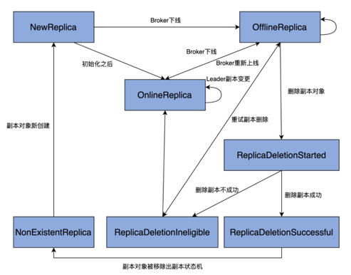

### 副本状态机

#### 7种副本状态
1. NewReplica: controller可以在分区重新分配期间创建新副本。 
    - 前置状态为NonExistentReplica
2. OnlineReplica: 启动副本，并且为它的分区分配了一些副本后的状态。
    - 前置状态为NewReplica, OnlineReplica, OfflineReplica
3. OfflineReplica: 副本下线后的状态。
    - 前置状态为NewReplica, OnlineReplica
4. ReplicaDeletionStarted: 开始删除副本后的状态。
    - 前置状态为OfflineReplica
5. ReplicaDeletionSuccessful: 删除副本请求后没有错误响应后的状态。
    - 前置状态为ReplicaDeletionStarted
6. ReplicaDeletionIneligible: 副本删除失败后的状态。
    - 前置状态为ReplicaDeletionStarted, OfflineReplica
7. NonExistentReplica: 成功删除副本后的状态。
    - 前置状态为ReplicaDeletionSuccessful
```scala
sealed trait ReplicaState {
  def state: Byte
  def validPreviousStates: Set[ReplicaState]
}

case object NewReplica extends ReplicaState {
  val state: Byte = 1
  val validPreviousStates: Set[ReplicaState] = Set(NonExistentReplica)
}

case object OnlineReplica extends ReplicaState {
  val state: Byte = 2
  val validPreviousStates: Set[ReplicaState] = Set(NewReplica, OnlineReplica, OfflineReplica, ReplicaDeletionIneligible)
}

case object OfflineReplica extends ReplicaState {
  val state: Byte = 3
  val validPreviousStates: Set[ReplicaState] = Set(NewReplica, OnlineReplica, OfflineReplica, ReplicaDeletionIneligible)
}

case object ReplicaDeletionStarted extends ReplicaState {
  val state: Byte = 4
  val validPreviousStates: Set[ReplicaState] = Set(OfflineReplica)
}

case object ReplicaDeletionSuccessful extends ReplicaState {
  val state: Byte = 5
  val validPreviousStates: Set[ReplicaState] = Set(ReplicaDeletionStarted)
}

case object ReplicaDeletionIneligible extends ReplicaState {
  val state: Byte = 6
  val validPreviousStates: Set[ReplicaState] = Set(OfflineReplica, ReplicaDeletionStarted)
}

case object NonExistentReplica extends ReplicaState {
  val state: Byte = 7
  val validPreviousStates: Set[ReplicaState] = Set(ReplicaDeletionSuccessful)
}
```
#### 抽象类 ReplicaStateMachine
```scala
abstract class ReplicaStateMachine(controllerContext: ControllerContext) extends Logging {
  // 最重要的处理状态转换方法
  def handleStateChanges(replicas: Seq[PartitionAndReplica], targetState: ReplicaState): Unit
}
```
#### ZkReplicaStateMachine
- logFailedStateChange：仅仅是记录一条错误日志，表明执行了一次无效的状态变更。
- logInvalidTransition：同样也是记录错误之用，记录一次非法的状态转换。
- logSuccessfulTransition：记录一次成功的状态转换操作。
- getTopicPartitionStatesFromZk：从 ZooKeeper 中获取指定分区的状态信息，包括每个分区的 Leader 副本、ISR 集合等数据。
- doRemoveReplicasFromIsr：把给定的副本对象从给定分区 ISR 中移除。
- removeReplicasFromIsr：调用 doRemoveReplicasFromIsr 方法，实现将给定的副本对象从给定分区 ISR 中移除的功能。
- doHandleStateChanges：执行状态变更和转换操作的主力方法。
```scala
class ZkReplicaStateMachine(config: KafkaConfig,
                            stateChangeLogger: StateChangeLogger,
                            controllerContext: ControllerContext,
                            zkClient: KafkaZkClient,
                            controllerBrokerRequestBatch: ControllerBrokerRequestBatch) 
  extends ReplicaStateMachine(controllerContext) with Logging {
  // replicas是一组副本对象，每个副本对象都封装了它们所属的主题和分区
  // targetState是这组副本对象要转换成的目标状态。
  override def handleStateChanges(replicas: Seq[PartitionAndReplica], targetState: ReplicaState): Unit = {
    if (replicas.nonEmpty) {
      try {
        // 清空Controller待发送请求集合
        controllerBrokerRequestBatch.newBatch()
        // 将所有副本对象按照Broker进行分组，依次执行状态转换操作
        replicas.groupBy(_.replica).foreach { case (replicaId, replicas) =>
          doHandleStateChanges(replicaId, replicas, targetState)
        }
        // 发送对应的Controller请求给Broker
        controllerBrokerRequestBatch.sendRequestsToBrokers(controllerContext.epoch)
      } catch {
        // 如果Controller易主，则记录错误日志 & 抛出异常
        case e: ControllerMovedException =>
          error(s"Controller moved to another broker when moving some replicas to $targetState state", e)
          throw e
        case e: Throwable => error(s"Error while moving some replicas to $targetState state", e)
      }
    }
  }

  /**
   * This API exercises the replica's state machine. It ensures that every state transition happens from a legal
   * previous state to the target state. Valid state transitions are:
   * NonExistentReplica --> NewReplica
   * --send LeaderAndIsr request with current leader and isr to the new replica and UpdateMetadata request for the
   *   partition to every live broker
   *
   * NewReplica -> OnlineReplica
   * --add the new replica to the assigned replica list if needed
   *
   * OnlineReplica,OfflineReplica -> OnlineReplica
   * --send LeaderAndIsr request with current leader and isr to the new replica and UpdateMetadata request for the
   *   partition to every live broker
   *
   * NewReplica,OnlineReplica,OfflineReplica,ReplicaDeletionIneligible -> OfflineReplica
   * --send StopReplicaRequest to the replica (w/o deletion)
   * --remove this replica from the isr and send LeaderAndIsr request (with new isr) to the leader replica and
   *   UpdateMetadata request for the partition to every live broker.
   *
   * OfflineReplica -> ReplicaDeletionStarted
   * --send StopReplicaRequest to the replica (with deletion)
   *
   * ReplicaDeletionStarted -> ReplicaDeletionSuccessful
   * -- mark the state of the replica in the state machine
   *
   * ReplicaDeletionStarted -> ReplicaDeletionIneligible
   * -- mark the state of the replica in the state machine
   *
   * ReplicaDeletionSuccessful -> NonExistentReplica
   * -- remove the replica from the in memory partition replica assignment cache
   *
   * @param replicaId The replica for which the state transition is invoked
   * @param replicas The partitions on this replica for which the state transition is invoked
   * @param targetState The end state that the replica should be moved to
   */

  private def doHandleStateChanges(replicaId: Int, replicas: Seq[PartitionAndReplica], targetState: ReplicaState): Unit = {
    // 尝试获取给定副本对象在controllerContext中的当前状态，如果没有保存某个副本对象的状态，会将其初始化为NonExistentReplica状态
    replicas.foreach(replica => controllerContext.putReplicaStateIfNotExists(replica, NonExistentReplica))
    // 将给定的副本对象集合划分成两部分：validReplicas & invalidReplicas
    val (validReplicas, invalidReplicas) = controllerContext.checkValidReplicaStateChange(replicas, targetState)
    // 记录错误日志
    invalidReplicas.foreach(replica => logInvalidTransition(replica, targetState))

    targetState match {
      case NewReplica =>
        validReplicas.foreach { replica =>
          // 获取该副本对象的分区对象
          val partition = replica.topicPartition
          // 获取副本对象的当前状态
          val currentState = controllerContext.replicaState(replica)

          controllerContext.partitionLeadershipInfo.get(partition) match {
            case Some(leaderIsrAndControllerEpoch) =>
              // 如果该副本是Leader副本
              if (leaderIsrAndControllerEpoch.leaderAndIsr.leader == replicaId) {
                val exception = new StateChangeFailedException(s"Replica $replicaId for partition $partition cannot be moved to NewReplica state as it is being requested to become leader")
                // 记录错误日志(Leader副本不能被设置成NewReplica状态)
                logFailedStateChange(replica, currentState, OfflineReplica, exception)
              } else {
                // 向该副本对象所在Broker发送请求，令其同步该分区数据
                controllerBrokerRequestBatch.addLeaderAndIsrRequestForBrokers(Seq(replicaId),
                  replica.topicPartition,
                  leaderIsrAndControllerEpoch,
                  controllerContext.partitionFullReplicaAssignment(replica.topicPartition),
                  isNew = true)
                logSuccessfulTransition(replicaId, partition, currentState, NewReplica)
                // 更新controllerContext中该副本对象状态为NewReplica
                controllerContext.putReplicaState(replica, NewReplica)
              }
            case None =>
              logSuccessfulTransition(replicaId, partition, currentState, NewReplica)
              // 仅仅更新controllerContext该副本对象状态为NewReplica即可
              controllerContext.putReplicaState(replica, NewReplica)
          }
        }
      case OnlineReplica =>
        validReplicas.foreach { replica =>
          val partition = replica.topicPartition
          val currentState = controllerContext.replicaState(replica)

          currentState match {
            case NewReplica =>
              // 从controllerContext中拿到分区副本列表
              val assignment = controllerContext.partitionFullReplicaAssignment(partition)
              // 如果副本列表不包含当前副本，视为异常情况
              if (!assignment.replicas.contains(replicaId)) {
                error(s"Adding replica ($replicaId) that is not part of the assignment $assignment")
                val newAssignment = assignment.copy(replicas = assignment.replicas :+ replicaId)
                // 将该副本加入到副本列表中，并更新元数据缓存中该分区的副本列表
                controllerContext.updatePartitionFullReplicaAssignment(partition, newAssignment)
              }
            case _ =>
              controllerContext.partitionLeadershipInfo.get(partition) match {
                case Some(leaderIsrAndControllerEpoch) =>
                  // 向该副本对象所在Broker发送请求，令其同步该分区数据
                  controllerBrokerRequestBatch.addLeaderAndIsrRequestForBrokers(Seq(replicaId),
                    replica.topicPartition,
                    leaderIsrAndControllerEpoch,
                    controllerContext.partitionFullReplicaAssignment(partition), isNew = false)
                case None =>
              }
          }
          logSuccessfulTransition(replicaId, partition, currentState, OnlineReplica)
          // 更新controllerContext中该副本对象状态为OnlineReplica
          controllerContext.putReplicaState(replica, OnlineReplica)
        }
      case OfflineReplica =>
        // 向副本所在Broker发送StopReplicaRequest请求
        validReplicas.foreach { replica =>
          controllerBrokerRequestBatch.addStopReplicaRequestForBrokers(Seq(replicaId), replica.topicPartition, deletePartition = false)
        }
        // 分组为replicasWithLeadershipInfo & replicasWithoutLeadershipInfo
        val (replicasWithLeadershipInfo, replicasWithoutLeadershipInfo) = validReplicas.partition { replica =>
          controllerContext.partitionLeadershipInfo.contains(replica.topicPartition)
        }
        // 对于有Leader信息的副本集合而言从，它们对应的所有分区中移除该副本对象并更新ZooKeeper节点
        val updatedLeaderIsrAndControllerEpochs = removeReplicasFromIsr(replicaId, replicasWithLeadershipInfo.map(_.topicPartition))
        updatedLeaderIsrAndControllerEpochs.foreach { case (partition, leaderIsrAndControllerEpoch) =>
          // 如果分区对应主题并未被删除
          if (!controllerContext.isTopicQueuedUpForDeletion(partition.topic)) {
            // 获取该分区除给定副本以外的其他副本所在的Broker
            val recipients = controllerContext.partitionReplicaAssignment(partition).filterNot(_ == replicaId)
            // 向这些Broker发送请求，更新该分区更新过的分区LeaderAndIsr数据
            controllerBrokerRequestBatch.addLeaderAndIsrRequestForBrokers(recipients,
              partition,
              leaderIsrAndControllerEpoch,
              controllerContext.partitionFullReplicaAssignment(partition), isNew = false)
          }
          val replica = PartitionAndReplica(partition, replicaId)
          val currentState = controllerContext.replicaState(replica)
          logSuccessfulTransition(replicaId, partition, currentState, OfflineReplica)
          // 更新controllerContext中该副本对象状态为OfflineReplica
          controllerContext.putReplicaState(replica, OfflineReplica)
        }

        replicasWithoutLeadershipInfo.foreach { replica =>
          val currentState = controllerContext.replicaState(replica)
          logSuccessfulTransition(replicaId, replica.topicPartition, currentState, OfflineReplica)
          // 向集群所有Broker发送请求，更新对应分区的元数据
          controllerBrokerRequestBatch.addUpdateMetadataRequestForBrokers(controllerContext.liveOrShuttingDownBrokerIds.toSeq, Set(replica.topicPartition))
          // 更新controllerContext中该副本对象状态为OfflineReplica
          controllerContext.putReplicaState(replica, OfflineReplica)
        }
      case ReplicaDeletionStarted =>
        validReplicas.foreach { replica =>
          val currentState = controllerContext.replicaState(replica)
          logSuccessfulTransition(replicaId, replica.topicPartition, currentState, ReplicaDeletionStarted)
          controllerContext.putReplicaState(replica, ReplicaDeletionStarted)
          controllerBrokerRequestBatch.addStopReplicaRequestForBrokers(Seq(replicaId), replica.topicPartition, deletePartition = true)
        }
      case ReplicaDeletionIneligible =>
        validReplicas.foreach { replica =>
          val currentState = controllerContext.replicaState(replica)
          logSuccessfulTransition(replicaId, replica.topicPartition, currentState, ReplicaDeletionIneligible)
          controllerContext.putReplicaState(replica, ReplicaDeletionIneligible)
        }
      case ReplicaDeletionSuccessful =>
        validReplicas.foreach { replica =>
          val currentState = controllerContext.replicaState(replica)
          logSuccessfulTransition(replicaId, replica.topicPartition, currentState, ReplicaDeletionSuccessful)
          controllerContext.putReplicaState(replica, ReplicaDeletionSuccessful)
        }
      case NonExistentReplica =>
        validReplicas.foreach { replica =>
          // 从controllerContext获取副本当前状态
          val currentState = controllerContext.replicaState(replica)
          // 从该主题分区的完整分配中移除该副本对象
          val newAssignedReplicas = controllerContext
            .partitionFullReplicaAssignment(replica.topicPartition)
            .removeReplica(replica.replica)
          // 更新controllerContext的该主题分区的副本分配
          controllerContext.updatePartitionFullReplicaAssignment(replica.topicPartition, newAssignedReplicas)
          logSuccessfulTransition(replicaId, replica.topicPartition, currentState, NonExistentReplica)
          // 从controllerContext的replicaStates移除该副本对象
          controllerContext.removeReplicaState(replica)
        }
    }
  }
}
```