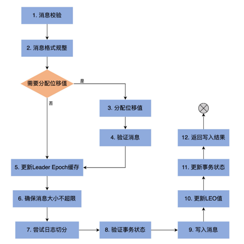

### highWatermark
- volatile:因为多个线程可能同时读取它，因此需要设置成 volatile，保证内存可见性。
- 初始值是logStartOffset
```scala
  @volatile private var highWatermarkMetadata: LogOffsetMetadata = LogOffsetMetadata(logStartOffset)

/*
 * A log offset structure, including:
 *  1. the message offset 消息位移
 *  2. the base message offset of the located segment 日志段起始位移
 *  3. the physical position on the located segment 日志段的物理位移
 */
case class LogOffsetMetadata(messageOffset: Long,
                             segmentBaseOffset: Long = Log.UnknownOffset,
                             relativePositionInSegment: Int = LogOffsetMetadata.UnknownFilePosition)
```
#### 获取和设置高水位
```scala
  def highWatermark: Long = highWatermarkMetadata.messageOffset

  private def updateHighWatermarkMetadata(newHighWatermark: LogOffsetMetadata): Unit = {
    if (newHighWatermark.messageOffset < 0) // hw不能为负数
      throw new IllegalArgumentException("High watermark offset should be non-negative")

    lock synchronized { 
      highWatermarkMetadata = newHighWatermark
      producerStateManager.onHighWatermarkUpdated(newHighWatermark.messageOffset)
      maybeIncrementFirstUnstableOffset()
    }
    trace(s"Setting high watermark $newHighWatermark")
  }
```
#### 更新高水位
```scala
  // 主要是Follower副本更新HW
  def updateHighWatermark(hw: Long): Long = {
    val newHighWatermark = if (hw < logStartOffset)
      logStartOffset
    else if (hw > logEndOffset)
      logEndOffset
    else
      hw
    // 更新高水位值
    updateHighWatermarkMetadata(LogOffsetMetadata(newHighWatermark))
    // 返回高水位值
    newHighWatermark
  }
  
  // 主要是Leader副本更新HW
  def maybeIncrementHighWatermark(newHighWatermark: LogOffsetMetadata): Option[LogOffsetMetadata] = {
    // 新HW不能大于LEO
    if (newHighWatermark.messageOffset > logEndOffset)
      throw new IllegalArgumentException(s"High watermark $newHighWatermark update exceeds current " +
        s"log end offset $logEndOffsetMetadata")

    lock.synchronized {
      val oldHighWatermark = fetchHighWatermarkMetadata

      // 新的HW > 旧的HW or (旧的HW==新的HW and 旧的HW.segmentBaseOffset < 新的HW.segmentBaseOffset) 即新的HW在新的LogSegment
      if (oldHighWatermark.messageOffset < newHighWatermark.messageOffset ||
        (oldHighWatermark.messageOffset == newHighWatermark.messageOffset && oldHighWatermark.onOlderSegment(newHighWatermark))) {
        updateHighWatermarkMetadata(newHighWatermark)
        Some(oldHighWatermark)
      } else {
        None
      }
    }
  }
```
#### 读取高水位
```scala
  private def fetchHighWatermarkMetadata: LogOffsetMetadata = {
    // 保证日志不能关闭
    checkIfMemoryMappedBufferClosed()
    // 保存当前高水位值到本地变量，避免多线程访问干扰
    val offsetMetadata = highWatermarkMetadata
    // 如果没有获取到segmentBaseOffset起始位移和relativePositionInSegment物理位置
    if (offsetMetadata.messageOffsetOnly) {
      lock.synchronized {
        // 通过读日志文件的方式把完整的高水位元数据信息拉出来
        val fullOffset = convertToOffsetMetadataOrThrow(highWatermark)
        // 更新高水位对象
        updateHighWatermarkMetadata(fullOffset)
        fullOffset
      }
    } else {
      offsetMetadata
    }
  }
```

### segments
- ConcurrentSkipListMap：线程安全
- ConcurrentSkipListMap：可排序，以起始位移为key
```scala
  private val segments: ConcurrentNavigableMap[java.lang.Long, LogSegment] = new ConcurrentSkipListMap[java.lang.Long, LogSegment]
```
#### addSegment
```scala
  @threadsafe
  def addSegment(segment: LogSegment): LogSegment = this.segments.put(segment.baseOffset, segment)
```

####  deleteOldSegments
```scala
  def deleteOldSegments(): Int = {
    if (config.delete) {
      deleteRetentionMsBreachedSegments() + deleteRetentionSizeBreachedSegments() + deleteLogStartOffsetBreachedSegments()
    } else {
      deleteLogStartOffsetBreachedSegments()
    }
  }
  // 基于时间保留
  private def deleteRetentionMsBreachedSegments(): Int = {
    if (config.retentionMs < 0) return 0
    val startMs = time.milliseconds
    deleteOldSegments((segment, _) => startMs - segment.largestTimestamp > config.retentionMs,
      reason = s"retention time ${config.retentionMs}ms breach")
  }
  // 基于文件大小
  private def deleteRetentionSizeBreachedSegments(): Int = {
    if (config.retentionSize < 0 || size < config.retentionSize) return 0
    var diff = size - config.retentionSize
    def shouldDelete(segment: LogSegment, nextSegmentOpt: Option[LogSegment]) = {
      if (diff - segment.size >= 0) {
        diff -= segment.size
        true
      } else {
        false
      }
    }

    deleteOldSegments(shouldDelete, reason = s"retention size in bytes ${config.retentionSize} breach")
  }
  // 基于LogStartOffset
  private def deleteLogStartOffsetBreachedSegments(): Int = {
    def shouldDelete(segment: LogSegment, nextSegmentOpt: Option[LogSegment]) =
      nextSegmentOpt.exists(_.baseOffset <= logStartOffset)

    deleteOldSegments(shouldDelete, reason = s"log start offset $logStartOffset breach")
  }
```
#### 查询日志段
- segments.firstEntry：获取第一个日志段对象
- segments.lastEntry：获取最后一个日志段对象，即 Active Segment
- segments.higherEntry：获取第一个起始位移值≥给定 Key 值的日志段对象
- segments.floorEntry：获取最后一个起始位移值≤给定 Key 值的日志段对象

### 关键位移值
#### LEO
更新时机：
- Log 对象初始化时
- 写入消息：append方法`updateLogEndOffset(appendInfo.lastOffset + 1)`
- Log 对象发生日志切分Log Roll时：roll方法`updateLogEndOffset(nextOffsetMetadata.messageOffset)`
- 日志截断Log Truncation时：truncateTo方法`updateLogEndOffset(targetOffset)`
```scala
  @volatile private var nextOffsetMetadata: LogOffsetMetadata = _
  
  // 初始化LEO
  nextOffsetMetadata = LogOffsetMetadata(nextOffset, activeSegment.baseOffset, activeSegment.size)

  // 更新LEO
  private def updateLogEndOffset(offset: Long): Unit = {
    nextOffsetMetadata = LogOffsetMetadata(offset, activeSegment.baseOffset, activeSegment.size)

    // HW不能大于LEO
    if (highWatermark >= offset) {
      updateHighWatermarkMetadata(nextOffsetMetadata)
    }

    if (this.recoveryPoint > offset) {
      this.recoveryPoint = offset
    }
  }
```
#### Log Start Offset
更新时机
- Log 对象初始化时：`updateLogStartOffset(math.max(logStartOffset, segments.firstEntry.getValue.baseOffset))`
- 日志截断：truncateTo方法`updateLogStartOffset(math.min(targetOffset, this.logStartOffset))`或truncateFullyAndStartAt方法`updateLogStartOffset(newOffset)`
- Follower 副本同步：一旦 Leader 副本的 Log 对象的 Log Start Offset 值发生变化。为了维持和 Leader 副本的一致性，Follower 副本也需要尝试去更新该值。
- 删除日志段：deleteSegments方法-> maybeIncrementLogStartOffset方法`updateLogStartOffset(newLogStartOffset)`

```scala
  private def updateLogStartOffset(offset: Long): Unit = {
    logStartOffset = offset

    if (highWatermark < offset) {
      updateHighWatermark(offset)
    }

    if (this.recoveryPoint < offset) {
      this.recoveryPoint = offset
    }
  }
```

#### append

```scala
  // Append message to the active segment of the log, rolling over to a fresh segment if necessary.
  private def append(records: MemoryRecords,
                     origin: AppendOrigin,
                     interBrokerProtocolVersion: ApiVersion,
                     assignOffsets: Boolean,
                     leaderEpoch: Int): LogAppendInfo = {
    maybeHandleIOException(s"Error while appending records to $topicPartition in dir ${dir.getParent}") {
      // 验证写入消息并返回校验结果
      val appendInfo = analyzeAndValidateRecords(records, origin)

      // return if we have no valid messages or if this is a duplicate of the last appended entry
      if (appendInfo.shallowCount == 0)
        return appendInfo

      // trim any invalid bytes or partial messages before appending it to the on-disk log
      var validRecords = trimInvalidBytes(records, appendInfo)

      // they are valid, insert them in the log
      lock synchronized {
        // 保证Log对象未关闭
        checkIfMemoryMappedBufferClosed()
        if (assignOffsets) {
          // assign offsets to the message set
          val offset = new LongRef(nextOffsetMetadata.messageOffset)
          // firstOffset是当前的LEO
          appendInfo.firstOffset = Some(offset.value)
          val now = time.milliseconds
          val validateAndOffsetAssignResult = try {
            LogValidator.validateMessagesAndAssignOffsets(validRecords,
              topicPartition,
              offset,
              time,
              now,
              appendInfo.sourceCodec,
              appendInfo.targetCodec,
              config.compact,
              config.messageFormatVersion.recordVersion.value,
              config.messageTimestampType,
              config.messageTimestampDifferenceMaxMs,
              leaderEpoch,
              origin,
              interBrokerProtocolVersion,
              brokerTopicStats)
          } catch {
            case e: IOException =>
              throw new KafkaException(s"Error validating messages while appending to log $name", e)
          }
          // 获取valid records
          validRecords = validateAndOffsetAssignResult.validatedRecords
          appendInfo.maxTimestamp = validateAndOffsetAssignResult.maxTimestamp
          appendInfo.offsetOfMaxTimestamp = validateAndOffsetAssignResult.shallowOffsetOfMaxTimestamp
          appendInfo.lastOffset = offset.value - 1
          appendInfo.recordConversionStats = validateAndOffsetAssignResult.recordConversionStats
          if (config.messageTimestampType == TimestampType.LOG_APPEND_TIME)
            appendInfo.logAppendTime = now

          // 验证消息，确保消息大小不超限
          if (validateAndOffsetAssignResult.messageSizeMaybeChanged) {
            for (batch <- validRecords.batches.asScala) {
              if (batch.sizeInBytes > config.maxMessageSize) {
                // we record the original message set size instead of the trimmed size
                // to be consistent with pre-compression bytesRejectedRate recording
                brokerTopicStats.topicStats(topicPartition.topic).bytesRejectedRate.mark(records.sizeInBytes)
                brokerTopicStats.allTopicsStats.bytesRejectedRate.mark(records.sizeInBytes)
                throw new RecordTooLargeException(s"Message batch size is ${batch.sizeInBytes} bytes in append to" +
                  s"partition $topicPartition which exceeds the maximum configured size of ${config.maxMessageSize}.")
              }
            }
          }
        } else {
          // we are taking the offsets we are given
          if (!appendInfo.offsetsMonotonic)
            throw new OffsetsOutOfOrderException(s"Out of order offsets found in append to $topicPartition: " +
                                                 records.records.asScala.map(_.offset))

          if (appendInfo.firstOrLastOffsetOfFirstBatch < nextOffsetMetadata.messageOffset) {
            // we may still be able to recover if the log is empty
            // one example: fetching from log start offset on the leader which is not batch aligned,
            // which may happen as a result of AdminClient#deleteRecords()
            val firstOffset = appendInfo.firstOffset match {
              case Some(offset) => offset
              case None => records.batches.asScala.head.baseOffset()
            }

            val firstOrLast = if (appendInfo.firstOffset.isDefined) "First offset" else "Last offset of the first batch"
            throw new UnexpectedAppendOffsetException(
              s"Unexpected offset in append to $topicPartition. $firstOrLast " +
              s"${appendInfo.firstOrLastOffsetOfFirstBatch} is less than the next offset ${nextOffsetMetadata.messageOffset}. " +
              s"First 10 offsets in append: ${records.records.asScala.take(10).map(_.offset)}, last offset in" +
              s" append: ${appendInfo.lastOffset}. Log start offset = $logStartOffset",
              firstOffset, appendInfo.lastOffset)
          }
        }

        // update the epoch cache with the epoch stamped onto the message by the leader
        validRecords.batches.asScala.foreach { batch =>
          if (batch.magic >= RecordBatch.MAGIC_VALUE_V2) {
            maybeAssignEpochStartOffset(batch.partitionLeaderEpoch, batch.baseOffset)
          } else {
            // In partial upgrade scenarios, we may get a temporary regression to the message format. In
            // order to ensure the safety of leader election, we clear the epoch cache so that we revert
            // to truncation by high watermark after the next leader election.
            leaderEpochCache.filter(_.nonEmpty).foreach { cache =>
              warn(s"Clearing leader epoch cache after unexpected append with message format v${batch.magic}")
              cache.clearAndFlush()
            }
          }
        }

        // check messages set size may be exceed config.segmentSize
        if (validRecords.sizeInBytes > config.segmentSize) {
          throw new RecordBatchTooLargeException(s"Message batch size is ${validRecords.sizeInBytes} bytes in append " +
            s"to partition $topicPartition, which exceeds the maximum configured segment size of ${config.segmentSize}.")
        }

        // maybe roll the log if this segment is full
        val segment = maybeRoll(validRecords.sizeInBytes, appendInfo)

        val logOffsetMetadata = LogOffsetMetadata(
          messageOffset = appendInfo.firstOrLastOffsetOfFirstBatch,
          segmentBaseOffset = segment.baseOffset,
          relativePositionInSegment = segment.size)

        // now that we have valid records, offsets assigned, and timestamps updated, we need to
        // validate the idempotent/transactional state of the producers and collect some metadata
        val (updatedProducers, completedTxns, maybeDuplicate) = analyzeAndValidateProducerState(
          logOffsetMetadata, validRecords, origin)

        maybeDuplicate.foreach { duplicate =>
          appendInfo.firstOffset = Some(duplicate.firstOffset)
          appendInfo.lastOffset = duplicate.lastOffset
          appendInfo.logAppendTime = duplicate.timestamp
          appendInfo.logStartOffset = logStartOffset
          return appendInfo
        }
        // 执行消息写入，主要调用日志段对象的append方法实现
        segment.append(largestOffset = appendInfo.lastOffset,
          largestTimestamp = appendInfo.maxTimestamp,
          shallowOffsetOfMaxTimestamp = appendInfo.offsetOfMaxTimestamp,
          records = validRecords)

        // 更新LEO
        updateLogEndOffset(appendInfo.lastOffset + 1)

        // update the producer state
        for (producerAppendInfo <- updatedProducers.values) {
          producerStateManager.update(producerAppendInfo)
        }

        // update the transaction index with the true last stable offset. The last offset visible
        // to consumers using READ_COMMITTED will be limited by this value and the high watermark.
        for (completedTxn <- completedTxns) {
          val lastStableOffset = producerStateManager.lastStableOffset(completedTxn)
          segment.updateTxnIndex(completedTxn, lastStableOffset)
          producerStateManager.completeTxn(completedTxn)
        }

        // always update the last producer id map offset so that the snapshot reflects the current offset
        // even if there isn't any idempotent data being written
        producerStateManager.updateMapEndOffset(appendInfo.lastOffset + 1)

        // update the first unstable offset (which is used to compute LSO)
        maybeIncrementFirstUnstableOffset()

        trace(s"Appended message set with last offset: ${appendInfo.lastOffset}, " +
          s"first offset: ${appendInfo.firstOffset}, " +
          s"next offset: ${nextOffsetMetadata.messageOffset}, " +
          s"and messages: $validRecords")

        if (unflushedMessages >= config.flushInterval)
          flush()

        appendInfo
      }
    }
  }
```
#### read
```scala
  def read(startOffset: Long,
           maxLength: Int,
           isolation: FetchIsolation, // 设置读取隔离级别
           minOneMessage: Boolean): FetchDataInfo = {
    maybeHandleIOException(s"Exception while reading from $topicPartition in dir ${dir.getParent}") {
      trace(s"Reading $maxLength bytes from offset $startOffset of length $size bytes")

      val includeAbortedTxns = isolation == FetchTxnCommitted

      // Because we don't use the lock for reading, the synchronization is a little bit tricky.
      // We create the local variables to avoid race conditions with updates to the log.
      val endOffsetMetadata = nextOffsetMetadata
      val endOffset = endOffsetMetadata.messageOffset
      // 找到startOffset值所在的日志段对象
      var segmentEntry = segments.floorEntry(startOffset)

      // return error on attempt to read beyond the log end offset or read below log start offset
      if (startOffset > endOffset || segmentEntry == null || startOffset < logStartOffset)
        throw new OffsetOutOfRangeException(s"Received request for offset $startOffset for partition $topicPartition, " +
          s"but we only have log segments in the range $logStartOffset to $endOffset.")

      // 查看一下读取隔离级别设置。 
      val maxOffsetMetadata = isolation match {
        // 普通消费者能够看到[Log Start Offset, LEO)之间的消息 
        case FetchLogEnd => endOffsetMetadata
        // Follower副本消费者能够看到[Log Start Offset，高水位值]之间的消息
        case FetchHighWatermark => fetchHighWatermarkMetadata
        // 事务型消费者只能看到[Log Start Offset, Log Stable Offset]之间的消息。
        case FetchTxnCommitted => fetchLastStableOffsetMetadata
      }

      if (startOffset == maxOffsetMetadata.messageOffset) {
        // 从LEO开始读，返回空消息集合
        return emptyFetchDataInfo(maxOffsetMetadata, includeAbortedTxns)
      } else if (startOffset > maxOffsetMetadata.messageOffset) {
        // 如果要读取的起始位置超过了能读取的最大位置，返回空的消息集合
        val startOffsetMetadata = convertToOffsetMetadataOrThrow(startOffset)
        return emptyFetchDataInfo(startOffsetMetadata, includeAbortedTxns)
      }

      // Do the read on the segment with a base offset less than the target offset
      // but if that segment doesn't contain any messages with an offset greater than that
      // continue to read from successive segments until we get some messages or we reach the end of the log
      while (segmentEntry != null) {
        val segment = segmentEntry.getValue

        val maxPosition = {
          // Use the max offset position if it is on this segment; otherwise, the segment size is the limit.
          if (maxOffsetMetadata.segmentBaseOffset == segment.baseOffset) {
            maxOffsetMetadata.relativePositionInSegment
          } else {
            segment.size
          }
        }
        // 调用segment.read方法
        val fetchInfo = segment.read(startOffset, maxLength, maxPosition, minOneMessage)
        if (fetchInfo == null) {
          segmentEntry = segments.higherEntry(segmentEntry.getKey)
        } else {
          return if (includeAbortedTxns)
            addAbortedTransactions(startOffset, segmentEntry, fetchInfo)
          else
            fetchInfo
        }
      }

      // okay we are beyond the end of the last segment with no data fetched although the start offset is in range,
      // this can happen when all messages with offset larger than start offsets have been deleted.
      // In this case, we will return the empty set with log end offset metadata
      FetchDataInfo(nextOffsetMetadata, MemoryRecords.EMPTY)
    }
  }
```