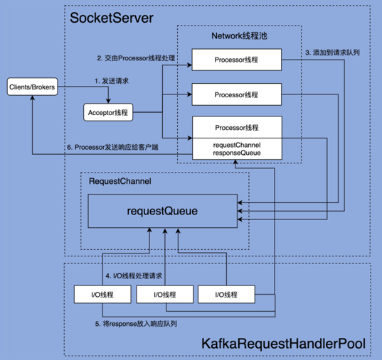

### Kafka 请求处理全流程
1. Clients 或 Broker 发送请求给 Acceptor 线程
```scala
  // Acceptor.run()  
  def run(): Unit = {
    serverChannel.register(nioSelector, SelectionKey.OP_ACCEPT)
    startupComplete()
    try {
      var currentProcessorIndex = 0
      while (isRunning) {
        try {
          val ready = nioSelector.select(500)
          if (ready > 0) {
            val keys = nioSelector.selectedKeys()
            val iter = keys.iterator()
            while (iter.hasNext && isRunning) {
              try {
                val key = iter.next
                iter.remove()
                if (key.isAcceptable) {
                  // accept新的连接，创建新的SocketChannel，并assign给processor放入newConnections队列
                  accept(key).foreach { socketChannel =>
                    var retriesLeft = synchronized(processors.length)
                    var processor: Processor = null
                    do {
                      retriesLeft -= 1
                      processor = synchronized {
                        currentProcessorIndex = currentProcessorIndex % processors.length
                        processors(currentProcessorIndex)
                      }
                      currentProcessorIndex += 1
                    } while (!assignNewConnection(socketChannel, processor, retriesLeft == 0))
                  }
                } else
                  throw new IllegalStateException("Unrecognized key state for acceptor thread.")
              } catch {
                case e: Throwable => error("Error while accepting connection", e)
              }
            }
          }
        }
        catch {
          case e: ControlThrowable => throw e
          case e: Throwable => error("Error occurred", e)
        }
      }
    } finally {
      debug("Closing server socket and selector.")
      CoreUtils.swallow(serverChannel.close(), this, Level.ERROR)
      CoreUtils.swallow(nioSelector.close(), this, Level.ERROR)
      shutdownComplete()
    }
  }
```
2. Processor 线程处理请求，并放入请求队列
```scala
  // Processor.run()  
  override def run(): Unit = {
    startupComplete()
    try {
      while (isRunning) {
        try {
          configureNewConnections() // selector.register(connectionId(channel.socket), channel)
          processNewResponses() // sendResponse(response, response.responseSend)
          poll() // selector.poll(pollTimeout)
          processCompletedReceives() // requestChannel.sendRequest(req) 将请求放入请求队列
          processCompletedSends() // response.onComplete.foreach(onComplete => onComplete(send))
          processDisconnected() // selector.disconnected
          closeExcessConnections() 
        } catch {
          case e: Throwable => processException("Processor got uncaught exception.", e)
        }
      }
    } finally {
      debug(s"Closing selector - processor $id")
      CoreUtils.swallow(closeAll(), this, Level.ERROR)
      shutdownComplete()
    }
  }
```
3. I/O 线程处理请求
```scala
  // KafkaRequestHandler.run()
  def run(): Unit = {
    while (!stopped) {
      val startSelectTime = time.nanoseconds
      val req = requestChannel.receiveRequest(300)
      val endTime = time.nanoseconds
      val idleTime = endTime - startSelectTime
      aggregateIdleMeter.mark(idleTime / totalHandlerThreads.get)
      req match {
        case RequestChannel.ShutdownRequest =>
          debug(s"Kafka request handler $id on broker $brokerId received shut down command")
          shutdownComplete.countDown()
          return
        // 从请求队列中获取 Request 实例，然后交由 KafkaApis 的 handle 方法，执行真正的请求处理逻辑。
        case request: RequestChannel.Request =>
          try {
            request.requestDequeueTimeNanos = endTime
            trace(s"Kafka request handler $id on broker $brokerId handling request $request")
            apis.handle(request)
          } catch {
            case e: FatalExitError =>
              shutdownComplete.countDown()
              Exit.exit(e.statusCode)
            case e: Throwable => error("Exception when handling request", e)
          } finally {
            request.releaseBuffer()
          }
        case null => // continue
      }
    }
    shutdownComplete.countDown()
  }
```
4. KafkaRequestHandler 线程将 Response 放入 Processor 线程的 Response 队列
```scala
  // KafkaApis.sendResponse()
  private def sendResponse(request: RequestChannel.Request,
                           responseOpt: Option[AbstractResponse],
                           onComplete: Option[Send => Unit]): Unit = {
    responseOpt.foreach(response => requestChannel.updateErrorMetrics(request.header.apiKey, response.errorCounts.asScala))

    val response = responseOpt match {
      case Some(response) =>
        val responseSend = request.context.buildResponse(response)
        val responseString =
          if (RequestChannel.isRequestLoggingEnabled) Some(response.toString(request.context.apiVersion))
          else None
        new RequestChannel.SendResponse(request, responseSend, responseString, onComplete)
      case None =>
        new RequestChannel.NoOpResponse(request)
    }
    // 调用链 : requestChannel.sendResponse -> processor.enqueueResponse(response)
    requestChannel.sendResponse(response)
  }
```
5. Processor 线程发送 Response 给 Request 发送方
```scala
  // Processor.sendResponse()
  protected[network] def sendResponse(response: RequestChannel.Response, responseSend: Send): Unit = {
    val connectionId = response.request.context.connectionId
    trace(s"Socket server received response to send to $connectionId, registering for write and sending data: $response")
    if (channel(connectionId).isEmpty) {
      warn(s"Attempting to send response via channel for which there is no open connection, connection id $connectionId")
      response.request.updateRequestMetrics(0L, response)
    }
    if (openOrClosingChannel(connectionId).isDefined) {
      selector.send(responseSend) // 底层调用selector.send
      inflightResponses += (connectionId -> response)
    }
  }
```

