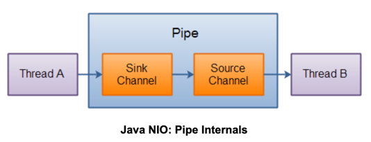

#### A Java **NIO Pipe** is a one-way data connection between two threads. 
#### A Pipe has a source channel and a sink channel. 
- You write data to the sink channel. 
- This data can then be read from the source channel.

```java
Pipe pipe = Pipe.open();
// read
Pipe.SourceChannel sourceChannel = pipe.source();
ByteBuffer buf = ByteBuffer.allocate(48);
int bytesRead = inChannel.read(buf);
// write
Pipe.SinkChannel sinkChannel = pipe.sink();
String newData = "New String to write to file..." + System.currentTimeMillis();
ByteBuffer buf = ByteBuffer.allocate(48);
buf.clear();
buf.put(newData.getBytes());
buf.flip();
while(buf.hasRemaining()) {
    sinkChannel.write(buf);
}
```