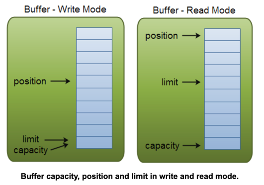

[参考链接](http://tutorials.jenkov.com/java-nio/index.html)

### Java NIO: Channels and Buffers
- In standard IO API you work with **byte streams** and **character streams**. 
- In NIO you work with **channels** and **buffers**. 
- Data is always _read from a channel into a buffer_, or _written from a buffer to a channel_.

> read: channel -> buffer
> write: buffer -> channel

#### Channel
All IO in NIO starts with a Channel.
- FileChannel：reads data from and to _files_
- DatagramChannel：can read and write data over _the network via UDP_
- SocketChannel：can read and write data over _the network via TCP_
- ServerSocketChannel：listen for _incoming TCP connections_


#### Buffer
- ByteBuffer:48 bytes `ByteBuffer buf = ByteBuffer.allocate(48);`
- CharBuffer:1024 characters `CharBuffer buf = CharBuffer.allocate(1024);`
- DoubleBuffer
- FloatBuffer
- IntBuffer
- LongBuffer
- ShortBuffer

```java
public abstract class Buffer {

    // Invariants: mark <= position <= limit <= capacity
    private int mark = -1;
    // When you flip a Buffer from writing mode to reading mode, the position is reset back to 0.
    private int position = 0; 
    // In write mode the limit is equal to the capacity of the Buffer. 
    // In read mode, limit is set to write position of the write mode.
    private int limit; 
    private int capacity;
}
```


使用Buffer进行读写的4个步骤：
1. Write data into the Buffer
2. Call buffer.flip()
    - switch the buffer from writing mode into reading mode 
    - Calling flip() sets the position back to 0, and sets the limit to where position just was.
```java
    public final Buffer flip() {
        limit = position;
        position = 0;
        mark = -1;
        return this;
    }
```
3. Read data out of the Buffer
4. Call buffer.clear() or buffer.compact() 
    - The clear() method clears the whole buffer. It the position is set back to 0 and the limit to capacity. **The data in the Buffer is not cleared.**
    - The compact() method only clears the data which you have already read. It copies all unread data to the beginning of the Buffer. Then it sets position to right after the last unread element. The limit property is still set to capacity.


### Java NIO: Non-blocking IO
- Java NIO enables you to do non-blocking IO. 
- For instance, a thread can ask a channel to read data into a buffer. 
- While the channel reads data into the buffer, the thread can do something else. 
- Once data is read into the buffer, the thread can then continue processing it. The same is true for writing data to channels.

### Java NIO: Selectors
- Java NIO contains the concept of "selectors". 
- A selector is an object that can monitor multiple channels for events. Thus, a single thread can monitor multiple channels for data.

#### Selectors
Four events
1. SelectionKey.OP_CONNECT
2. SelectionKey.OP_ACCEPT
3. SelectionKey.OP_READ
4. SelectionKey.OP_WRITE

Three methods返回已ready的通道数
1. int select()：blocks until at least one channel is ready for the events you registered for.
2. int select(long timeout)：it blocks for a maximum of timeout milliseconds
3. int selectNow()：**doesn't block at all.** It returns immediately with whatever channels are ready.
```java
Selector selector = Selector.open();
channel.configureBlocking(false);
SelectionKey key = channel.register(selector, SelectionKey.OP_READ);

while(true) {
  int readyChannels = selector.selectNow();
  if(readyChannels == 0) continue;
  Set<SelectionKey> selectedKeys = selector.selectedKeys();
  Iterator<SelectionKey> keyIterator = selectedKeys.iterator();
  while(keyIterator.hasNext()) {
    SelectionKey key = keyIterator.next();
    if(key.isAcceptable()) {
        // a connection was accepted by a ServerSocketChannel.
    } else if (key.isConnectable()) {
        // a connection was established with a remote server.
    } else if (key.isReadable()) {
        // a channel is ready for reading
    } else if (key.isWritable()) {
        // a channel is ready for writing
    }
    keyIterator.remove();
  }
}
```

```java
public static void main(String[] args) throws IOException {
        RandomAccessFile file = new RandomAccessFile("data/nio-data.txt", "rw");
        FileChannel inChannel = file.getChannel();
        ByteBuffer buf = ByteBuffer.allocate(48);
        int bytesRead = inChannel.read(buf);
        while (bytesRead != -1) {

            buf.flip();

            while (buf.hasRemaining()) {
                System.out.print((char) buf.get());
            }

            buf.clear();
            bytesRead = inChannel.read(buf);
        }
        file.close();
    }
```