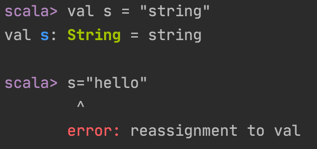
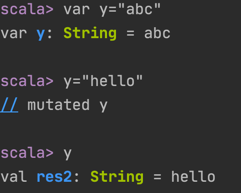

### val 和 var 变量
- **val** is an _immutable_ variable, like final in Java — and should be preferred

- **var** creates a _mutable_ variable, and should only be used when there is a specific reason to use it
