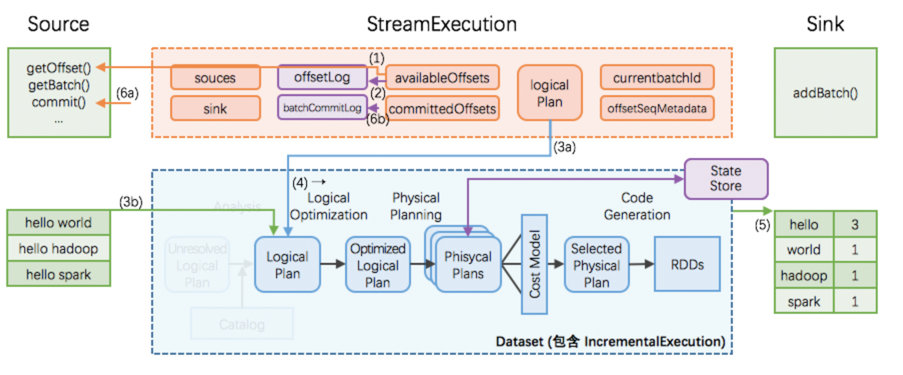

### StreamExecution
主要是以下三个部分：
- sources: streaming data 的产生端
- logicalPlan: DataFrame/Dataset 的一系列变换
- sink: 最终结果写出的接收端

1. StreamExecution 通过 _Source.getOffset()_ 获取最新的 offsets，即最新的数据进度；
2. StreamExecution 将 offsets 等写入到 **offsetLog** 里
    - 这里的 offsetLog 是一个持久化的 WAL (Write-Ahead-Log)，是将来可用作故障恢复用
3. StreamExecution 构造本次执行的 LogicalPlan
    - (3a) 将预先定义好的逻辑（即 StreamExecution 里的 logicalPlan 成员变量）制作一个副本出来
    - (3b) 给定刚刚取到的 offsets，通过 _Source.getBatch(offsets)_ 获取本执行新收到的数据的 Dataset/DataFrame 表示，并替换到 (3a) 中的副本里
    - 经过 (3a), (3b) 两步，构造完成的 LogicalPlan 就是针对本次执行新收到的数据的 Dataset/DataFrame 变换了
4. 触发对本次执行的 LogicalPlan 的优化，得到 IncrementalExecution增量执行
    - 逻辑计划的优化：通过 Catalyst 优化器完成
    - 物理计划的生成与选择：结果是可以直接用于执行的 RDD DAG
    - 逻辑计划、优化的逻辑计划、物理计划、及最后结果 RDD DAG，合并起来就是 IncrementalExecution
5. 将表示计算结果的 Dataset/DataFrame (包含 IncrementalExecution) 交给 Sink，即调用 _Sink.add(ds/df)_
6. 计算完成后的 commit
    - (6a) 通过 _Source.commit()_ 告知 Source 数据已经完整处理结束；Source 可按需完成数据的 garbage-collection
    - (6b) 将本次执行的批次 id 写入到 **batchCommitLog** 里
    
#### 故障恢复
`存储 source offsets 的 offsetLog，和存储计算状态的 StateStore，是全局高可用的`
Driver 故障恢复：
- 读取 **offsetLog** 恢复出最新的 offsets 等；相当于取代正常流程里的 (1)(2) 步
- 读取 **batchCommitLog** 决定是否需要重做最近一个批次
- 如果需要，那么重做 (3a), (3b), (4), (5), (6a), (6b) 步
- 这里第 (5) 步需要分两种情况讨论
    - (i) 如果上次执行在 (5) **结束前即失效**，那么本次执行里 sink 应该完整写出计算结果
    - (ii) 如果上次执行在 (5) **结束后才失效**，那么本次执行里 sink 可以重新写出计算结果（覆盖上次结果），也可以跳过写出计算结果
这样即可保证每次执行的计算结果，在 sink 这个层面，是 **不重不丢** 的 —— 即使中间发生过 1 次或以上的失效和恢复。
