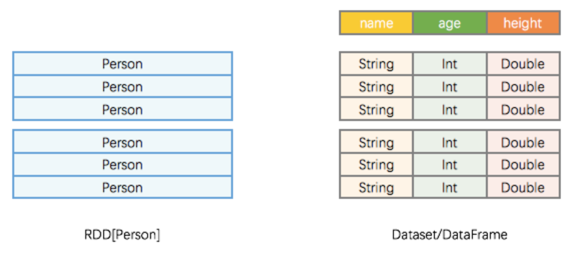
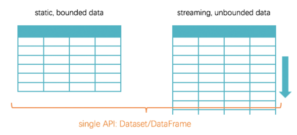

#### RDD vs Dataset/DataFrame


#### Structured Data vs Streaming Data


#### Structured Streaming
```
// 创建一个 SparkSession 程序入口
val spark = SparkSession.builder().master("localhost").getOrCreate()  
// 将 input_dir 里的内容创建为 Dataset/DataFrame，即 input table
val lines = spark.readStream.textFile("input_dir")  
val words = lines.flatMap(_.split(" "))
// 对 "value" 列做 count，得到多行二列的 Dataset/DataFrame，即 result table
val wordCounts = words.groupBy("value").count()
// 新起一个线程开始真正不停写出    
val query = wordCounts.writeStream                 
  .outputMode("complete")                          
  .format("console")                               
  .start()                                     
// 当前用户主线程挂住，等待新起来的写出线程结束
query.awaitTermination()                           
```