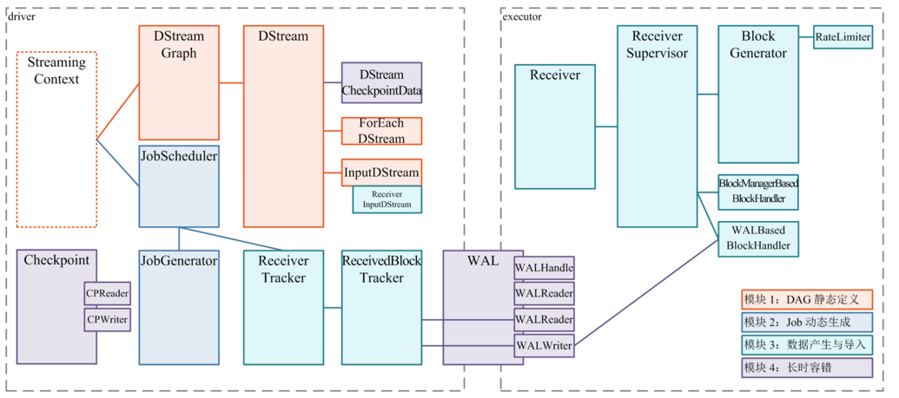

### Spark Streaming 的整体模块划分


模块 1：DAG 静态定义
-
DStream 和 RDD 的关系 : 
- DStream = 相同数据流的连续RDD序列
- RDD = DStream at batch T

创建DStream的方式
1. 通过StreamingContext从实时数据生成
2. 通过其他DStreams的方法生成，例如`map`, `window`,`reduceByKeyAndWindow`

模块 2：Job 动态生成
-
```scala
  /** DStream generates RDD 的时间间隔 */
  def slideDuration: Duration

// JobGenerator 维护了一个定时器，周期是 batchDuration，定时为每个 batch 生成 RDD DAG 的实例。
/** Generate jobs and perform checkpointing for the given `time`.  */
  private def generateJobs(time: Time): Unit = {
    // Checkpoint all RDDs marked for checkpointing to ensure their lineages are
    // truncated periodically. Otherwise, we may run into stack overflows (SPARK-6847).
    ssc.sparkContext.setLocalProperty(RDD.CHECKPOINT_ALL_MARKED_ANCESTORS, "true")
    Try {
      // 1. receiverTracker将收到的块分配到batch
      jobScheduler.receiverTracker.allocateBlocksToBatch(time) // allocate received blocks to batch
      // 2. graph生成RDD作业
      graph.generateJobs(time) // generate jobs using allocated block
    } match {
      case Success(jobs) =>
        // 3. 获取信息
        val streamIdToInputInfos = jobScheduler.inputInfoTracker.getInfo(time)
        // 4. 提交给jobScheduler运行
        jobScheduler.submitJobSet(JobSet(time, jobs, streamIdToInputInfos))
      case Failure(e) =>
        jobScheduler.reportError("Error generating jobs for time " + time, e)
        PythonDStream.stopStreamingContextIfPythonProcessIsDead(e)
    }
    // 5. 对整个系统的当前运行状态做一个 checkpoint
    eventLoop.post(DoCheckpoint(time, clearCheckpointDataLater = false))
  }
```

模块 3：数据产生与导入
-
Spark Streaming 在程序刚开始运行时：
1. 由 ReceiverTracker 分发多个 job（每个 job 有 1 个 task），到多个 executor 上分别启动 ReceiverSupervisor 实例
2. 每个 ReceiverSupervisor 启动后将马上生成一个用户提供的 Receiver 实现的实例 —— 该 Receiver 实现可以持续产生或者持续接收系统外数据
```scala
private def startReceiver( receiver: Receiver[_], scheduledLocations: Seq[TaskLocation]): Unit = {
  // ...
  // Function to start the receiver on the worker node
  val startReceiverFunc: Iterator[Receiver[_]] => Unit =
    (iterator: Iterator[Receiver[_]]) => {
      if (!iterator.hasNext) {
        throw new SparkException("Could not start receiver as object not found.")
      }
      if (TaskContext.get().attemptNumber() == 0) {
        val receiver = iterator.next()
        assert(iterator.hasNext == false)
        val supervisor = new ReceiverSupervisorImpl(
          receiver, SparkEnv.get, serializableHadoopConf.value, checkpointDirOption)
        supervisor.start()
        supervisor.awaitTermination()
      } else {
        // It's restarted by TaskScheduler, but we want to reschedule it again. So exit it.
      }
    }
  // ...
}
```
3. Receiver 在 onStart() 启动后，就将持续不断地接收外界数据，并持续交给 ReceiverSupervisor 进行数据转储
4. ReceiverSupervisor 持续不断地接收到 Receiver 转来的数据：
    - 如果数据很细小，就需要 BlockGenerator 攒多条数据成一块、然后再成块存储
    - 反之就不用攒，直接成块存储
    - Spark Streaming 目前支持两种成块存储方式
        - 由 BlockManagerBasedBlockHandler 直接存到 executor 的内存或硬盘
        - 由 WriteAheadLogBasedBlockHandler 是同时写 WAL 和 executor 的内存或硬盘
```scala
private val receivedBlockHandler: ReceivedBlockHandler = {
    if (WriteAheadLogUtils.enableReceiverLog(env.conf)) {
      if (checkpointDirOption.isEmpty) {
        throw new SparkException(
          "Cannot enable receiver write-ahead log without checkpoint directory set. " +
            "Please use streamingContext.checkpoint() to set the checkpoint directory. " +
            "See documentation for more details.")
      }
      new WriteAheadLogBasedBlockHandler(env.blockManager, env.serializerManager, receiver.streamId,
        receiver.storageLevel, env.conf, hadoopConf, checkpointDirOption.get)
    } else {
      new BlockManagerBasedBlockHandler(env.blockManager, receiver.storageLevel)
    }
}
```
5. 每次成块在 executor 存储完毕后，ReceiverSupervisor 就会及时上报块数据的 meta 信息给 driver 端的 ReceiverTracker
    - 这里的 meta 信息包括数据的标识 id，数据的位置，数据的条数，数据的大小等信息
6. ReceiverTracker 再将收到的块数据 meta 信息直接转给自己的成员 ReceivedBlockTracker，由 ReceivedBlockTracker 专门管理收到的块数据 meta 信息。

模块 4：长时容错
-
保障模块 1 和 2 需要在 **driver** 端完成，保障模块 3 需要在 **executor** 端和 **driver** 端完成。
- **executor 端长时容错**
    1. 热备：热备是指在存储块数据时，将其存储到本 executor、并同时 replicate 到另外一个 executor 上去。这样在一个 replica 失效后，可以立刻无感知切换到另一份 replica 进行计算。
        - 实现方式是，在实现自己的 Receiver 时，即指定一下 StorageLevel 为 MEMORY_ONLY_2 或 MEMORY_AND_DISK_2 就可以了。
    2. 冷备：冷备是每次存储块数据前，先把块数据作为 log 写出到 WriteAheadLog 里，再存储到本 executor。
        - executor 失效时，就由另外的 executor 去读 WAL，再重做 log 来恢复块数据。WAL 通常写到可靠存储如 HDFS 上，所以恢复时可能需要一段 recover time。
    3. 重放：如果上游支持重放，比如 Apache Kafka，那么就可以选择不用热备或者冷备来另外存储数据了，而是在失效时换一个 executor 进行数据重放即可。
    4. 忽略：最后，如果应用的实时性需求大于准确性，那么一块数据丢失后我们也可以选择忽略、不恢复失效的source数据。

- **driver 端长时容错**
    1. 块数据的 meta 信息上报到 ReceiverTracker(模块3)，然后交给 ReceivedBlockTracker 做具体的管理。ReceivedBlockTracker 也采用 WAL 冷备方式进行备份，在 driver 失效后，由新的 ReceivedBlockTracker 读取 WAL 并恢复 block 的 meta 信息。
    2. 需要定时对 DStreamGraph(模块1) 和 JobScheduler(模块2) 做 Checkpoint，来记录整个 DStreamGraph 的变化、和每个 batch 的 job 的完成情况。
        - 注意到这里采用的是完整 checkpoint 的方式，和之前的 WAL 的方式都不一样。Checkpoint 通常也是落地到可靠存储如 HDFS。
        - Checkpoint 发起的间隔默认的是和 batchDuration 一致；即每次 batch 发起、提交了需要运行的 job 后就做 Checkpoint，另外在 job 完成了更新任务状态的时候再次做一下 Checkpoint。
        - 这样一来，在 driver 失效并恢复后，可以读取最近一次的 Checkpoint 来恢复作业的 DStreamGraph 和 job 的运行及完成状态。