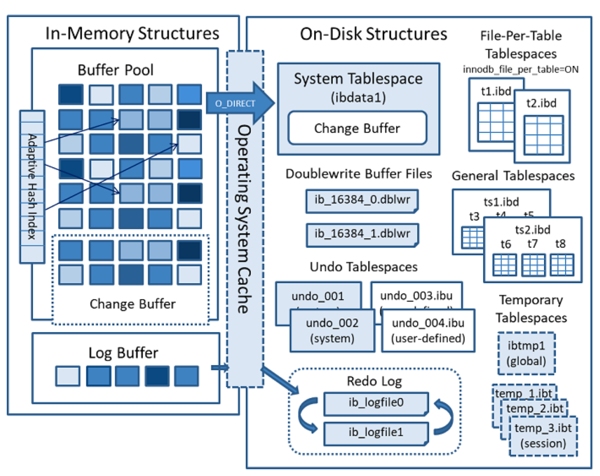
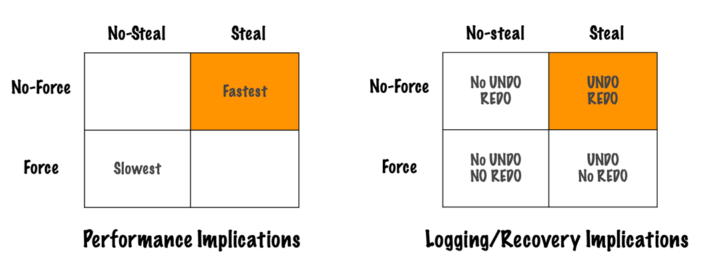
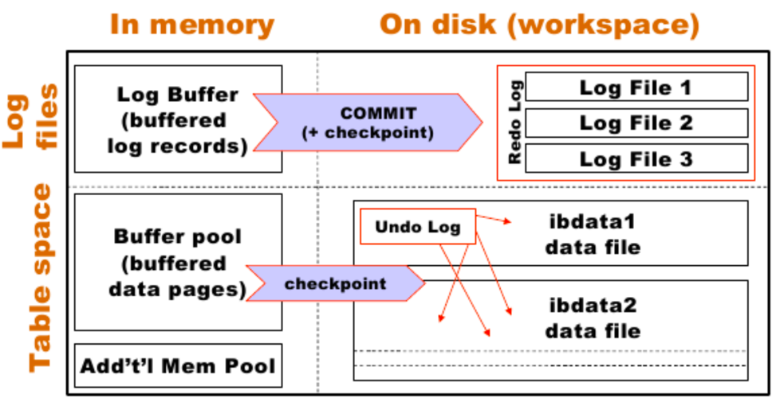
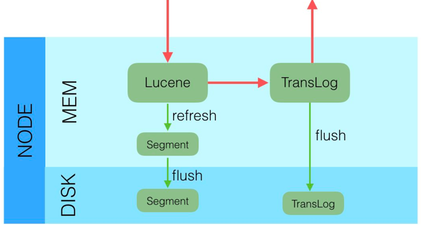

### disk-based
读写磁盘很慢。
1. write to disk
2. disk return ack
3. read disk

### RAM
先ack再落盘 : 性能好，但有可能丢失数据。
1. write to RAM
2. **RAM return ack**
3. **RAM persist to disk**
4. read RAM
---
先落盘再ack : 性能减弱，但不会丢失数据。
1. write to RAM
2. **RAM persist to disk**
3. **RAM return ack**
4. read RAM

### WAL
性能好 & 数据安全
1. write data to RAM
2. **write op to LOG**
3. **LOG return ack**
4. RAM persist to disk
5. read RAM

### What is WAL?
- append-only & order by time
- 提高性能
    - 减少磁盘写
        - 操作commit之前需要保证log已经落盘
        - 顺序写log
    - 从内存读数据
- WAL提供原子性和持久性

### WAL使用场景
#### InnoDB
- 原子性 : uncommitted data aborted
- 持久性 : committed data durable
- Crash Recovery
    - crash之后重启，会比较WAL的data和database的data
    - roll back uncommitted data in WAL
    - apply committed data in WAL but not in database

- Buffer Management Policies
    - COMMITTED write : Force & No-Force(redo)
    - UNCOMMITTED write : No-Steal & Steal(undo)
    - 建议Steal & No-Force 

- ARIES算法
    - physical logging : _Page 24;image at 367,2;before:'we';after:'Wa'_
    - logical logging : _Student:update(2,'wengwu'=>'Wangwu')_
        - high-level operations are logged
        - not necessarily limited to a single page
    - physiological logging : _Page 24:update(2,'wengwu'=>'Wangwu')_
        - log entry may only affect a single page
    - **Undo——logical** & **Redo——physiological**
    - ARIES流程
        - Analysis: 计算minDirtyPageLSN(redo开始的地方)
        - Redo(start->end): 找到最早的脏页
        - Undo(start<-end): 找到丢失事务的earliest change
        - 辅助数据结构(LSN-LogSequenceNumber)
            - TransactionTable(TT): TransID+lastLSN
            - DirtyPageTable(DPT): pageID+recoveryLSN
        - Log Records in Detail
            - Log Record: [preLSN, TransID, type]
            - Update Log Record: [preLSN, TransID, "update", pageID, redoInfo, undoInfo]
            - Compensation Log Record: [preLSN, TransID, “compensation”, redoTheUndoInfo, undoNextLSN]
    
- innodb_flush_log_at_trx_commit
    - 1: disk(推荐)
    - 2: FileSystem Buffer
    - 0: Log Buffer
- When update a row
    1. Write **Undo log** A
    2. Write **Redo log of Undo log** A
    3. Update data page
    4. Write **Redo log of data**
- Shadow paging算法
    - 包括Current page和Shadow page
    - 技术是copy-on-write
    - 缺点是同一时刻一个事务;资源紧张

#### Elasticsearch
- Translog
    - 当data存储在memory时，数据commit to a segment file之前需要写Translog
    - Each shard has one translog
- refresh——memory
    1. memory buffer writing and opening a new segment
- flush——disk
    1. in-memory buffer written to new segments
    2. existing in-memory segments committed to the disk
    3. new commit point write to the disk
    4. clears the old translog

    
