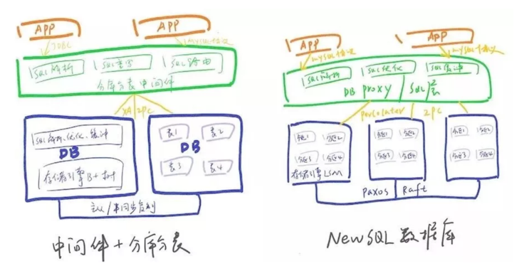

### 分库分表 vs NewSQL

- 传统数据库面向磁盘设计，基于内存的存储管理及并发控制，不如NewSQL数据库那般高效利用；
- 中间件模式SQL解析、执行计划优化等在中间件与数据库中重复工作，效率相比较低；
- NewSQL数据库的分布式事务相比于XA进行了优化，性能更高；
- NewSQL数据库存储设计即为基于Paxos/Raft协议的多副本，相比于传统数据库主从模式，在实现了真正的高可用、高可靠（RTO<30s，RPO=0）；
- NewSQL数据库天生支持数据分片，数据的迁移、扩容都是自动化的，大大减轻了DBA的工作，同时对应用透明，无需在SQL指定分库分表键。

#### 分布式事务
1. CAP限制
    - NewSQL数据库的鼻祖Google Spanner（目前绝大部分分布式数据库都是按照Spanner架构设计的）提供了一致性和大于5个9的可用性，宣称是一个“实际上是CA”的，其真正的含义是系统处于CA状态的概率非常高，由于网络分区导致的服务停用的概率非常小，究其真正原因是其打造私有全球网保证了不会出现网络中断引发的网络分区，另外就是其高效的运维队伍，这也是cloud spanner的卖点。
2. 完备性
    - 目前已知的NewSQL在分布式事务支持上都是不完整的
3. 性能
    - NewSQL数据库的分布式事务实现也仍然多基于两阶段提交协议，可以放弃ACID(Atomicity, Consistency, Isolation,  Durability)，转投BASE(Basically Available, Soft state, Eventually consistent)
    
#### 横向扩展与分片机制
- NewSQL数据库都是天生内置分片机制的，而且会根据每个分片的数据负载(磁盘使用率、写入速度等)自动识别热点，然后进行分片的分裂、数据迁移、合并，这些过程应用是无感知的，这省去了DBA的很多运维工作量。以TiDB为例，它将数据切成region，如果region到64M时，数据自动进行迁移。
- 分库分表模式下需要应用设计之初就要明确各表的拆分键、拆分方式（range、取模、一致性哈希或者自定义路由表）、路由规则、拆分库表数量、扩容方式等。相比NewSQL数据库，这种模式给应用带来了很大侵入和复杂度，这对大多数系统来说也是一大挑战。

#### 存储引擎
- 传统关系数据库的存储引擎设计都是面向磁盘的，大多都基于B+树。B+树通过降低树的高度减少随机读、进而减少磁盘寻道次数，提高读的性能，但大量的随机写会导致树的分裂，从而带来随机写，导致写性能下降。
- NewSQL的底层存储引擎则多采用LSM，相比B+树LSM将对磁盘的随机写变成顺序写，大大提高了写的性能。不过LSM的的读由于需要合并数据性能比B+树差，一般来说LSM更适合应在写大于读的场景。当然这只是单纯数据结构角度的对比，在数据库实际实现时还会通过SSD、缓冲、bloom filter等方式优化读写性能，所以读性能基本不会下降太多。