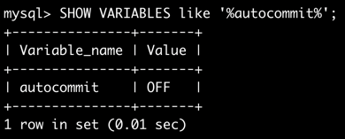
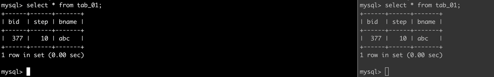
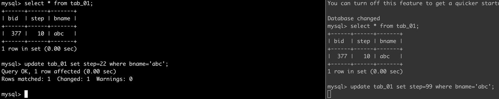
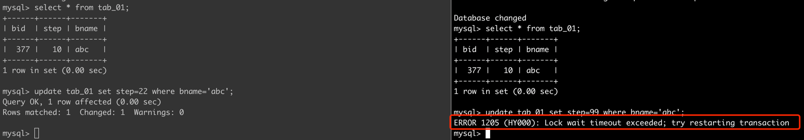
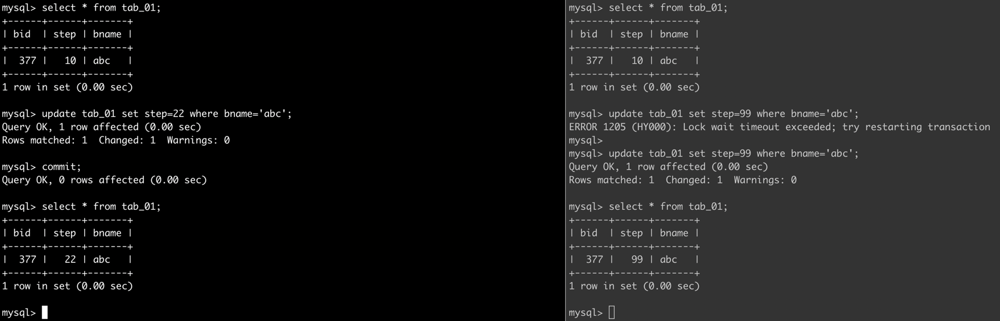
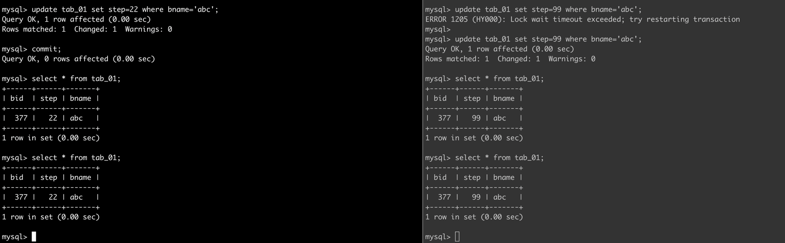
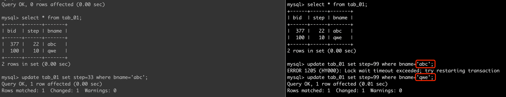

### AutoCommit之事务死锁
昨日，测试环境切了一个新的数据库集群，项目正常运行了不久后，通过日志发现hung住了
万思不得其解，于是jstack看了线程，发现BLOCk了，因此追踪这个问题
最后发现，是因为数据库的自动提交关闭了。
---

当autocommit关闭之后，将会发生神奇的事情...
```roomsql
SHOW VARIABLES like '%autocommit%';
```


我们来做个实验吧...
- 首先，看下表的初始状态

- 对第一个会话执行了update操作，然后对第二个会话执行了update操作的时候，陷入了等待

- 最终报错语句是'Lock wait timeout exceeded; try restarting transaction'

- commit之后，第二个会话可以执行update操作

- 但是我很疑惑，为什么select出来不是最新的结果呢？


#### 结论
1. 当前一个事务未提交/回滚时，新的事务无法提交
2. 事务锁的级别是行锁
